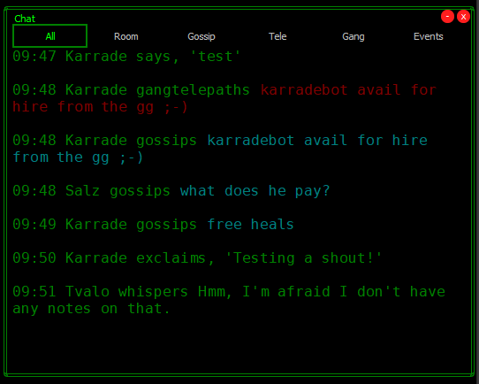

# mrChat

`mrChat` is a Mudlet package that creates a multi-tabbed chat window:



## Install

Run the following commands in the Mudlet command prompt:

```
lua installPackage("https://github.com/MajicRealmers/mudletAddons/raw/main/packages/mrChat/build/mrChat.mpackage")

resetprofile
```
